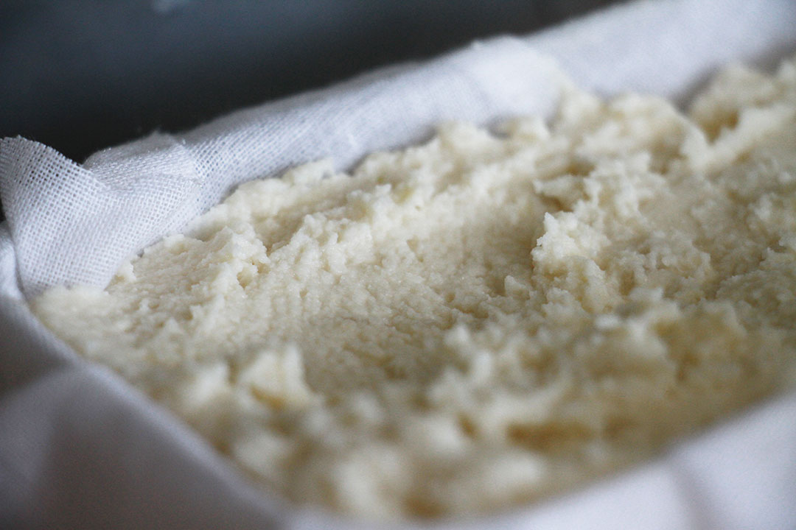
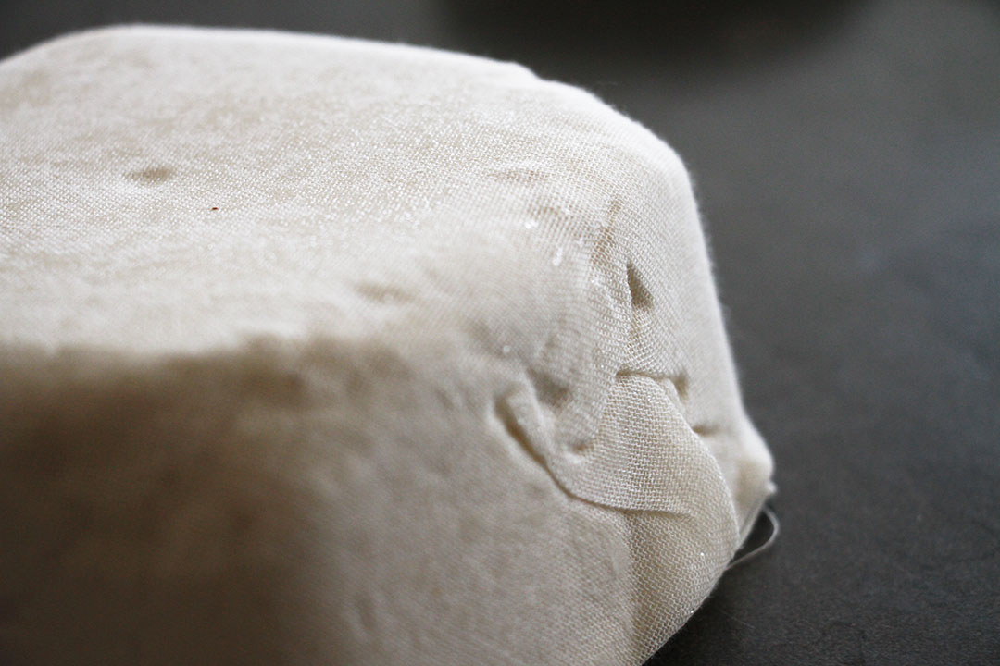
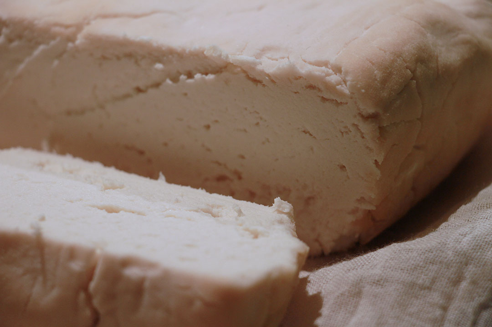

# Raw almond *feta*

Based on Miyoko Shinner's recipe from [The Homemade Vegan Pantry](https://www.google.co.uk/shopping/product/15771574996979029873)

Yields: XX g of *cheese* (to-be-discovered).

## Ingredients

Name | Quantity
---- | --------
blanched almonds | 2 cups 
[rejuvelac](../rejuvelac) | 1 cup
salt | 1/2 tsp
agar powder | 2 tbsp
water | 2/3 cup

### Brine

Name | Quantity
---- | --------
salt | 3/4 cup
water | 6 cups 

## Tools

* Bowl/jar, to soak the almonds
* Blender
* Container/jar with non-permeable lid, for the almond+rejuvelac mixture culture
* Pan, to prepare the agar+water mixture
* Cheese-cloth
* Cheese mould (or a strainer) 
* Bowl (large) for the brine
* Cloth to cover the brine bowl

## Method

Step 	| Description | Duration | Notes
---- 	| ----------- | -------- | ----- 
1		| Soak the almonds | 12 to 24 hours
2		| Blanch the almonds if they aren't blanched already. | | This is a tedious and time-consuming task: it may take ~3-10 seconds per almond, and you have 100+ to peel. Consider getting the almonds already blanched.   Pouring boiling water over the soaked almonds makes the blanching much faster, [see video](https://youtu.be/2hqAUFf9RZ8?t=42s)
3		| Drain and rinse the almonds. 
4 		| Blend almonds, rejuvelac and salt. | 1-2 minutes | Until smooth an no longer grainy
5 		| Pour the mixture into a container and cover with a non-permeable lid. | | *The mixture shouldn't breathe, hence the non-permeable lid?*
6		| Leave the mixture to **culture** | 1-2 days | Taste it regularly, until it begins to get **tangy**. In warmer weather it could take just a day, while in colder weather it could be 2 days or even more.
7		| Line a mould with cheese-cloth | | *Dimensions?* 8		| In a pan, mix water + agar powder and whisk ||
9 		| Cover with a lid and simmer, until it bubbles. | 4-5 minutes | The mixture may seem to solidify after ~2 minutes. If you let it simmer over low heat for a couple more minutes it will liquify again and bubble away.   At this point it may be good to test squeezing the water out of the culture, before mixing in the melted agar
10		| Pour the liquified agar into the almond+rejuvelac culture and combine
11		| Pour the mixture into the cheese-cloth lined mould/strainer | | It needs to breathe and lose the moist. *Maybe it doesn't need the container, just the cheese-cloth.*
12		| Refrigerate until hard | Several hours | *How many? How hard?* More than a day, and it was still moist (see notes below). *Maybe it doesn't need to stay in the fridge*
13		| In a large bowl, mix together water and salt (see [brine](#brine) quantities) | |
14		| Cut the cheese into a few pieces (eg 4) and place it in the brine | | 
15 	| Cover with a cloth and let sit. | *8 hours?*

## Experiments

### Batch 1

* 08.08.2015
	* Measured 1 cup of dry almonds (and then halved the other ingredients). It's not clear yet if the 2 cups measure refers to dry or soaked. Soaked almonds are heavier and more voluminous than dry ones.
* 09.08.2015
	* Used fresh quinoa rejuvelac (just drained from the sprouts)
	* The mixture came out a bit grainy and not as smooth as it could (due to blender not working well with small quantities)
	* Left to culture for ~30 hours (morning 09.08 - afternoon 10.08), average temperature ~26C
	
* 10.08.2015
	* After pouring the agar+almond+rejuvelac mixture into a cloth-lined container, covered it with a non-permeable lid and placed it in the fridge (*temperature?*)  
	
* 11.08.2015 
	* Kept in the fridge for ~20 hours, and it hadn't solidified. It was slightly harder than the day before, but still rather soft (say, like a ricotta) and moist. Probably because of the lid.
	* Removed the lid and placed it back in the fridge. 
* 12.08.2015 
	* After a day, the mixture has solidified a bit (although is not nearly as hard as traditional feta), so took it out of the fridge and into the brine	 
	* A few (~3) hours into the brine and the pieces were melting away, so took it out and place it in a container. Consistency: like a spread.
	* Experiment failed, it's nothing like feta, but the spread was decent (a little too tangy though).

### Batch 2

* 09.08.2015
	* Soaked almonds (2 cups, measured dry)
* 10.08.2015
	* Used refrigerated quinoa rejuvelac (one day in the fridge), and slightly more than a cup (~1.2 cups) to get the mixture smoother.
	* Left to culture for ~24 hours (morning 10.08 - morning 11.08), average temperature ~26C
* 11.08.2015
	* Placed the agar+almond+rejuvelac mixture into a cloth-lined container and in the fridge (without lid)
	* After 6 hours in the fridge, flipped the cheese mould upside down and soaked up a bit of moisture with kitchen paper
	
* 13.08.2015 
	* Still quite moist and not hard at all: if you tried to cut it it wouldn't keep its shape.
	* 16:00: changed the cheesecloth and placed it in the oven at ~40C, without container. The aim is to dry it up as much as possible, so it may take a few hours
	* Moisture seems to be a big problem. Possible solutions: 
		* squeezing the moisture out of the almond+rejuvelac culture before mixing in the agar powder
		* activating the agar properly, see [this video](https://www.youtube.com/watch?v=oa8rA7hT5dc)
		* use a container that can let the cheese breathe (maybe on a slanted surface to let the liquid get away)
	* Left it in the oven for 5 hours: a slightly darker rind started to form and the whole thing was a bit more solid and dry. Tasted very tangy (too much rejuvelac?)
	
	* 21:30: wrapped it in new cheese cloth and place it on a grid at room temperature (~26C)	
* 14.08.2015
	* 11:30 sprinkled salt flakes on the cheese cloth to dry the moisture out
	

### Byproducts

What could be done with the following?

* Water from soaked almonds
* Almond skins

### TODO

- [ ] Try juice from sauerkraut instead of rejuvelac
- [ ] Measures in g / ml instead of cups?

<!--
 See https://www.youtube.com/watch?v=7jS35hfiMHc
-->