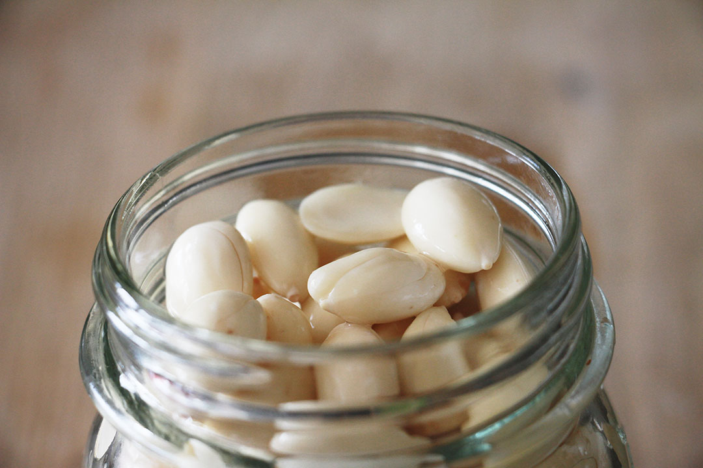
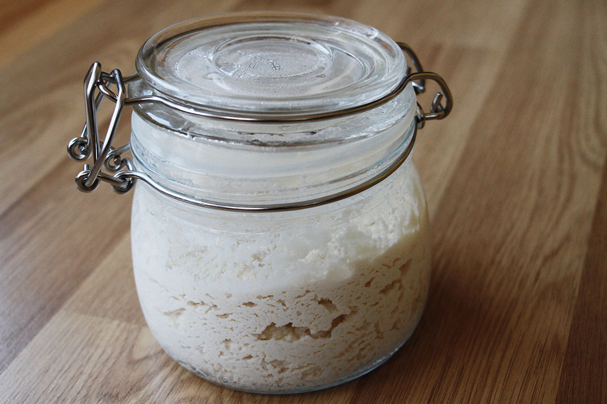
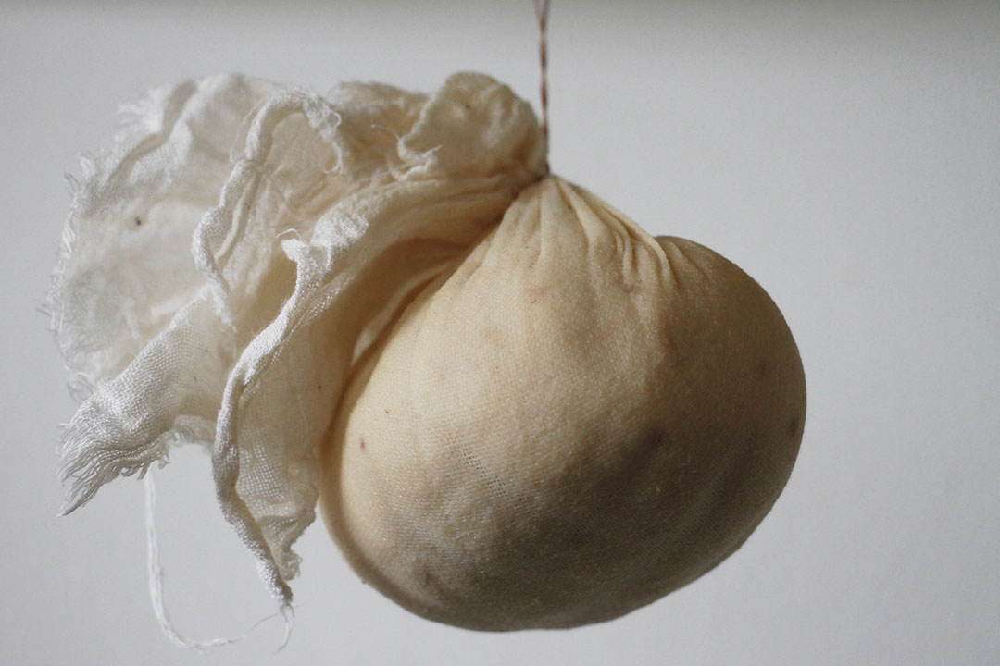

# Raw almond *gruyere*

Based on Mary Lin recipe from [Mary's Test Kitchen](https://www.youtube.com/watch?v=oa0uRrIQS0I)

Yields: XX g of *cheese* (to-be-discovered).

## Ingredients

Name | Quantity
---- | --------
blanched almonds | 1 cup 
[rejuvelac](../rejuvelac) | ~1/3 cup
salt | ~1 tsp 
nutritional yeast | 1 tsp
yellow miso paste | 1 tsp

## Tools

* Jar (to soak almonds)
* Blender
* Container with non-permeable lid (for the almond+rejuvelac mixture culture)
* Cheese-cloth
* Bowl (to be lined with cheese-cloth, used to pour in the all-ingredients mixture)

## Method

Step 	| Description | Duration | Notes
---- 	| ----------- | -------- | ----- 
1		| Soak the almonds | From 8 to 16 hours (overnight) |[See this video](https://www.youtube.com/watch?v=2hqAUFf9RZ8) for steps 1-6
2		| Blanch the almonds if they aren't blanched already. | | This is a tedious and time-consuming task: it may take ~3-10 seconds per almond, and you have 100+ to peel. Consider getting the almonds already blanched.   Pouring boiling water over the soaked almonds makes the blanching much faster, [see video](https://youtu.be/2hqAUFf9RZ8?t=42s) 
3		| Drain and rinse the almonds. 
4 		| Blend almonds, rejuvelac and salt. | 1-2 minutes | Until smooth an no longer grainy
5 		| Pour the mixture into a container and cover with a non-permeable lid. | | *The mixture shouldn't breathe, hence the non-permeable lid?* Or maybe it should breathe.. [see notes below](#batch-1)
6		| Leave the mixture to **culture** | 1-2 days | Taste it regularly, until it begins to get **tangy**. In warmer weather it could take just a day, while in colder weather it could be 2 days or even more.
7		| Mix in the yeast, miso, and a pinch of salt | 1-2 minutes | Until well combined.
8		| Line a bowl with cheese-cloth | | Big enough for the mixture to fill it, but don't worry about its shape because you won't let the mixture in for long.   Cheese-cloth must be clean (sterilise it in boiling water before).
9		| Pour the mixture into the cheese-cloth lined bowl, smooth it out to get rid of the air pockets | | 
10		| Gather up the cheese-cloth and squeeze out some of the liquid from the mixture || *2-3 tsp?*
11 	| Tie the cheese-cloth ||
12		| Sprinkle salt all around it || This should prevent mold from developing
13 	| Put the cheese onto a grid, or hang it || To let the moisture drain out
14 	| Let it dry and culture at room temperature | 1-3 days |

## Experiments

### Batch 1

* 13.08.2015
	* 18:00: soaked 1 cup of dry almonds, temp ~26C
* 14.08.2015
	* 12:00: started almond+rejuvelac culture
	
	* Used refrigerated quinoa rejuvelac (5 days in the fridge)
	* Used immersion blender, first with only the almonds, trying to get them as smooth as possible (without burning the blender!) and then added in 1/3 cup rejuvelac and a pinch of salt
	* Didn't close the lid hermetically, left it **slightly open** instead. Little pockets of air started to form inside the culture
	
* 16.08.2015
	* 13:30: mixed in (red) miso, yeast flakes and a pinch of salt, lined in cheese-cloth, squeezed and hung
	 
	* Sprinkled salt on the cheese-cloth
* 18.08.2015
	* 10:30: opened up the cheese-cloth and tasted the thing. Miso flavour overwhelms the rest, and it does still taste a bit too tangy (*rajuvelacy* as we started to call it)  
* 20.08.2015
	* 11:00: transferred in the fridge (in a sealed box)  	
	
### Batch 2

* 16.08.2015
	* 12:00: soaked 1 cup of dry almonds, temp ~26C for ~9 hours
	* 21:00: started almond+rejuvelac culture
* 18.08.2015	
	* 11:00: mixed in yeast flakes and a pinch of salt, lined in cheese-cloth, squeezed and hung
	* No miso in this one, but a bit more yeast (abundant tsp)
	* Sprinkled salt on the cheese-cloth
	 
	
		
<!--* 09.08.2015
	* Used fresh quinoa rejuvelac (just drained from the sprouts)
	* The mixture came out a bit grainy and not as smooth as it could (due to blender not working well with small quantities)
	* Left to culture for ~30 hours (morning 09.08 - afternoon 10.08), average temperature ~26C
 
	
* 10.08.2015
	* After pouring the agar+almond+rejuvelac mixture into a cloth-lined container, covered it with a non-permeable lid and placed it in the fridge (*temperature?*)  
  
	
* 11.08.2015 
	* Kept in the fridge for ~20 hours, and it hadn't solidified. It was slightly harder than the day before, but still rather soft (say, like a ricotta) and moist. Probably because of the lid.
	* Removed the lid and placed it back in the fridge. 
* 12.08.2015 
	* After a day, the mixture has solidified a bit (although is not nearly as hard as traditional feta), so took it out of the fridge and into the brine	 
	* A few (~3) hours into the brine and the pieces were melting away, so took it out and place it in a container. Consistency: like a spread

### Batch 2

* 09.08.2015
	* Soaked almonds (2 cups, measured dry)
* 10.08.2015
	* Used refrigerated quinoa rejuvelac (one day in the fridge), and slightly more than a cup (~1.2 cups) to get the mixture smoother.
	* Left to culture for ~24 hours (morning 10.08 - morning 11.08), average temperature ~26C
* 11.08.2015
	* Placed the agar+almond+rejuvelac mixture into a cloth-lined container and in the fridge (without lid)
	* After 6 hours in the fridge, flipped the cheese mould upside down and soaked up a bit of moisture with kitchen paper

	
* 13.08.2015 
	* Still quite moist and not hard at all: if you tried to cut it it wouldn't keep its shape.
	* Changed the cheesecloth and placed it in the oven at ~40C, without container. The aim is to dry it up as much as possibly, so it may take a few hours
	* Moisture seems to be a big problem. Possible solutions: 
		* squeezing the moisture out of the almond+rejuvelac culture before mixing in the agar powder
		* activating the agar properly, see [this video](https://www.youtube.com/watch?v=oa8rA7hT5dc)
		* use a container that can let the cheese breathe (maybe on a slanted surface to let the liquid get away)-->

### Byproducts

What could be done with the following?

* Water from soaked almonds
* Almond skins

### TODO

- [ ] Try juice from sauerkraut instead of rejuvelac
- [ ] Measures in g / ml instead of cups?

