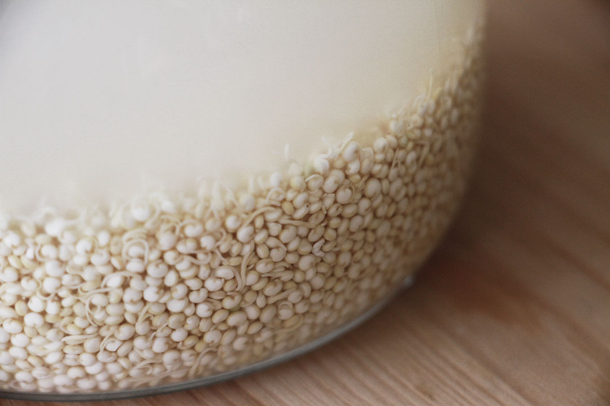

# Rejuvelac (quinoa)

> A non-alcoholic fermented liquid made from sprouted grains. 

> Because it is fermented, Rejuvelac contains beneficial bacteria and active enzymes, and thus it can improve digestion of food.

> From [Wikipedia](https://en.wikipedia.org/wiki/Rejuvelac)

Yields about 4 cups.

Based on Miyoko Shinner's recipe, and [this video](https://youtu.be/B693ZIdF_3oo)

## Ingredients

Name | Quantity
---- | --------
quinoa | 80g (1/2 cup)
water | ~3 cups 

## Tools

* Jar
* Cheese-cloth

## Method

Step 	| Description | Duration | Notes
---- 	| ----------- | -------- | ----- 
1		| Soak the quinoa (cover them with cold water) | 8 to 12 hours
2		| Drain
3		| Secure the jar with cheese-cloth. Rinse and drain until you see sprouts. | Less than 24 hours 
4 		| Fill the jar with water, cover with a lid.
5 		| Leave at room temperature, out of direct sunlight | 2-3 days | Until the water is cloudy and bubbly
6		| Strain out the seeds | | You can turn the strained sprouts into another batch of rejuvelac by refilling the jar with water and let it sit for another couple of days
7 		| Refrigerate the liquid (which is now acid-rich rejuvelac) | | It keeps in the fridge for 3-4 weeks. 

## Experiments

### Batch 1

* Started on 07.08.2015.
* Soaked quinoa for ~12 hours
* After ~12 hours most grains sprouted (rinsed and drained once) 
* Refilled the jar with water 3 times 
  
	
	
### Batch 2

* 01.09.2015
	* Evening: soaked 1/2 cup quinoa overnight

* 02.09.2015
	* Morning: rinsed and drained a 2-3 times, until the water in the jar was clear, then covered with a cheese-cloth and let it out at room temperature (~23-25C)

* 03.09.2015
	* Morning: a few seeds have sprouted, will wait until the evening 	 

Gone bad...

# Batch 3

* 15.09.2015
    * 18:30: soaked 100g of white quinoa (by Despar, not organic) in cold water

* 16.09.2015
    * 09:30: rinsed to let it sprout, leaving a couple spoons of water in so that seeds don't dry out	
    14:00: rinsed again
    20:00: rinsed once more, very little sprouting going on

* 17.09.2015
    13:00: some sprouts, decided to move on to the next step and covered with fresh water

* 19.09.2015 
    09:00: liquid is bubbly and cloudy, smells like rejuvelac, let's bottle it	

# Batch 4

* 18.09.2015
    * 20:30: soaked 50g of white quinoa (by Ecor, organic) in cold water

* 19.09.2015
    * 09:00: rinsed to let it sprout, leaving a couple spoons of water in so that seeds don't dry out. There are already quite a few sprouts.

* 21.09.2015
    * 14:30: bubbly and cloudy with almost all seeds sprouted, let's bottle it and then fill it with new water to start a new batch..

# Batch 5

* 13.10.2015
    * 20:00: soaked 80g of white quinoa (by Suma, organic) in cold water	

### Byproducts

What could be done with the following?

* Sprouted quinoa: [this maybe?](http://www.mynewroots.org/site/2008/01/organic-garden-in-your-kitchen-2/)

### TODO

- [ ] How many batches of rejuvelac can you make with one batch of quinoa seeds? How does the resulting rejuvelac change?
- [ ] How does the rejuvelac change when kept in the fridge?
